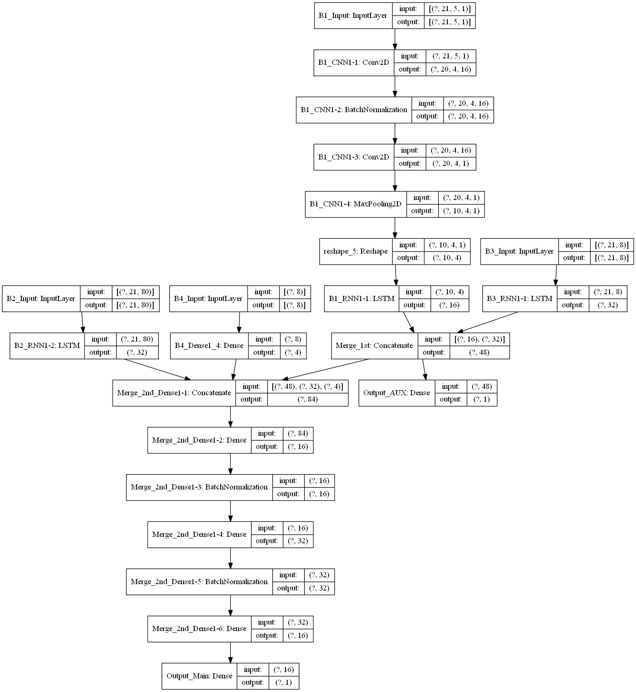

## The Sales Unit Prediction Model (SKU Level)
### Purpose
1) To predict customers' demands regarding specific SKUs.
2) The model should predict the number of sales, 9 days in advance. 

### Dataset
1) Each rows of dataset has 3 weeks (21 days) features (Time-Series)
2) Entire dataset size is about 160k.
3) There are 3 inputs. 
3-1) Basic Numeric Features 
3-2) Feature Engineered Features : Likes Moving Average & STD 
3-3) Date Features
4) There are 2 outpus. 
4-1) Auxiliary output (The Number of Sales Unit 1 day in advance) 
4-2) Main output (The Number of Sales Unit 9 days in advance / The model's target)

### Model

